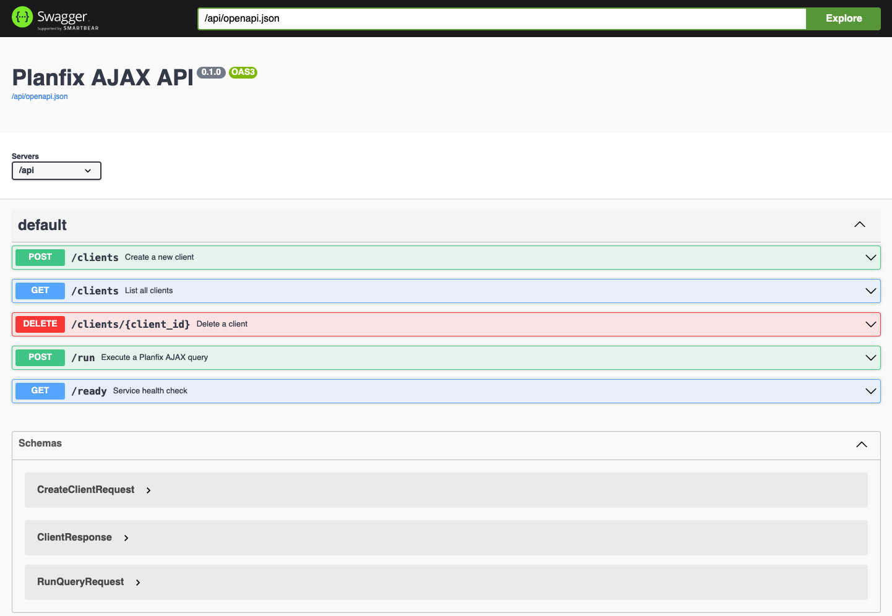

**RU** | [EN](README.md)

# planfix-ajax-api

HTTP-прокси для выполнения AJAX-запросов к Planfix. Сервис аутентифицируется через headless Chromium, захватывает сессионные токены и проксирует API-вызовы через авторизованные сессии.

---

## Содержание

- [Docker](#docker)
- [API и Swagger](#api-и-swagger)
- [Переменные окружения](#переменные-окружения)

---

## Docker

### Сборка и запуск

```bash
docker compose up
```

### Остановка

```bash
docker compose down
```

Проверка готовности сервиса:

```bash
curl http://localhost:8000/api/ready
```

---

## API и Swagger

> **Порядок работы:** сначала создайте клиента через `POST /api/clients` и сохраните полученный `id`, затем передавайте его как `client_id` в каждом запросе `POST /api/run`.

При включённом `SWAGGER_ENABLED=true` интерактивная документация доступна по адресу:

```
http://localhost:8000/api/ui/
```



Все эндпоинты расположены под префиксом `/api`.

### Управление клиентами


| Метод    | Путь                       | Описание             |
| -------- | -------------------------- | -------------------- |
| `POST`   | `/api/clients`             | Создать клиента      |
| `GET`    | `/api/clients`             | Список всех клиентов |
| `DELETE` | `/api/clients/{client_id}` | Удалить клиента      |


**Создать клиента** — `POST /api/clients`

`Content-Type: application/x-www-form-urlencoded`


| Поле       | Обязательно | Описание               |
| ---------- | ----------- | ---------------------- |
| `domain`   | да          | Домен Planfix-инстанса |
| `login`    | да          | Логин Planfix          |
| `password` | да          | Пароль Planfix         |


Возвращает `201` с телом `{id, login, domain}`.

### Выполнение запроса


| Метод  | Путь       | Описание                        |
| ------ | ---------- | ------------------------------- |
| `POST` | `/api/run` | Выполнить AJAX-запрос к Planfix |


**Выполнить запрос** — `POST /api/run`

`Content-Type: application/json`


| Поле        | Обязательно | Описание                              |
| ----------- | ----------- | ------------------------------------- |
| `client_id` | да          | ID ранее созданного клиента           |
| `payload`   | да          | JSON-объект, передаваемый в `/ajax/`  |


Возвращает `200` с ответом Planfix.

### Проверка готовности


| Метод | Путь         | Описание                        |
| ----- | ------------ | ------------------------------- |
| `GET` | `/api/ready` | `200` — готов, `404` — не готов |


---

## Переменные окружения

Настройки читаются из переменных окружения или файла `.env` в корне проекта.


| Переменная         | По умолчанию | Описание                                    |
| ------------------ | ------------ | ------------------------------------------- |
| `SWAGGER_ENABLED`  | `false`      | Включить Swagger UI по адресу `/api/ui/`    |
| `BROWSER_HEADLESS` | `true`       | Запускать Chromium в headless-режиме        |
| `BROWSER_TIMEOUT`  | `30000`      | Таймаут операций Playwright в миллисекундах |
